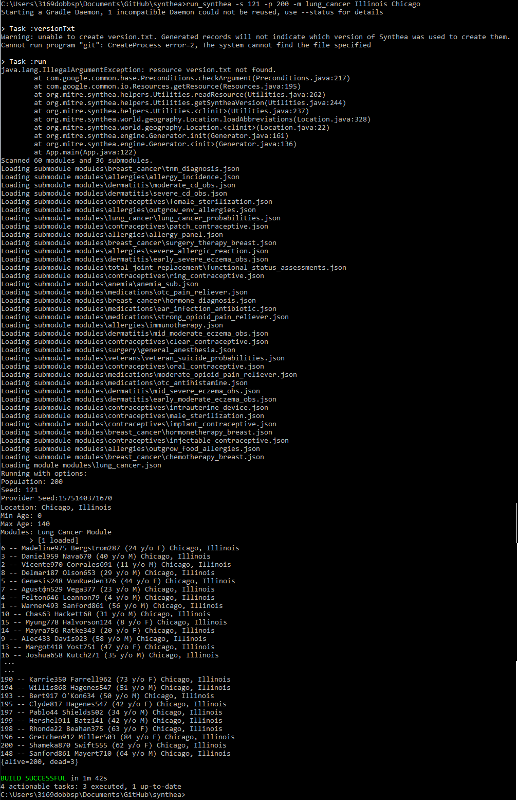
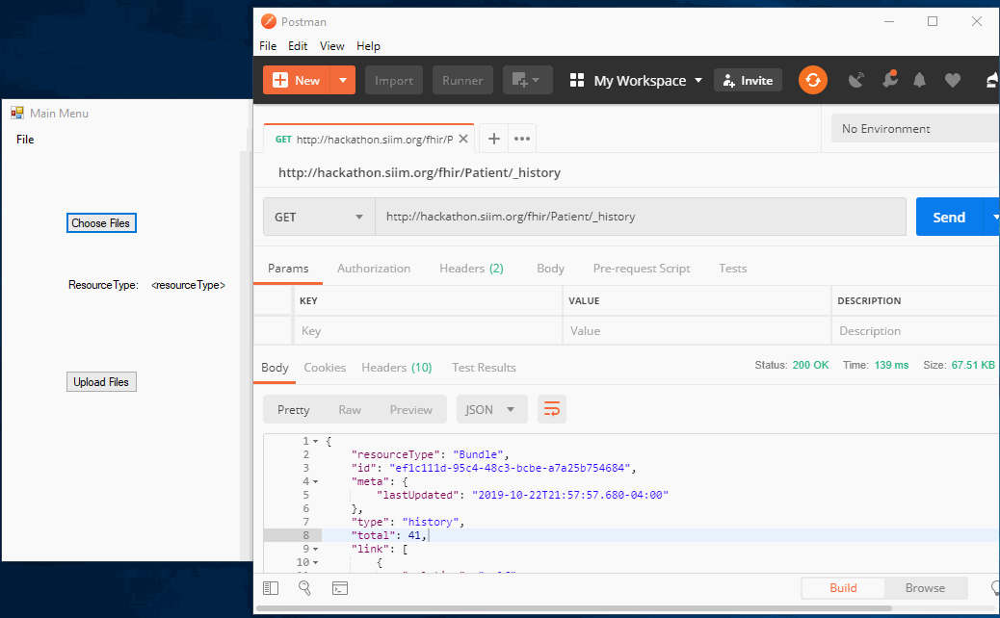

# forms_on_fhir
attempts at a form interface for generating FHIR resources

### Generate Data Using [Synthea](https://github.com/synthetichealth/synthea)

## [try_windows_forms](try_windows_forms/Forms)

### DEMO

## references
* [Synthea](https://synthetichealth.github.io/synthea/) - sythetic patient generation
* [fhir-json-schema](https://stackoverflow.com/questions/41427110/fhir-json-schema)
